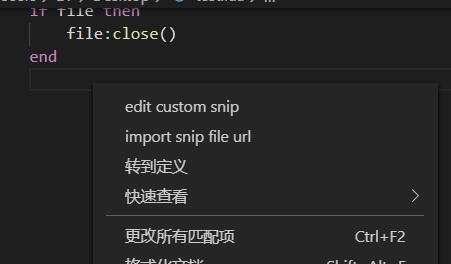
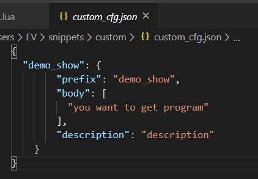
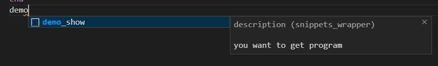
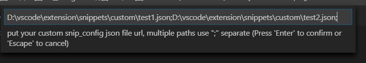
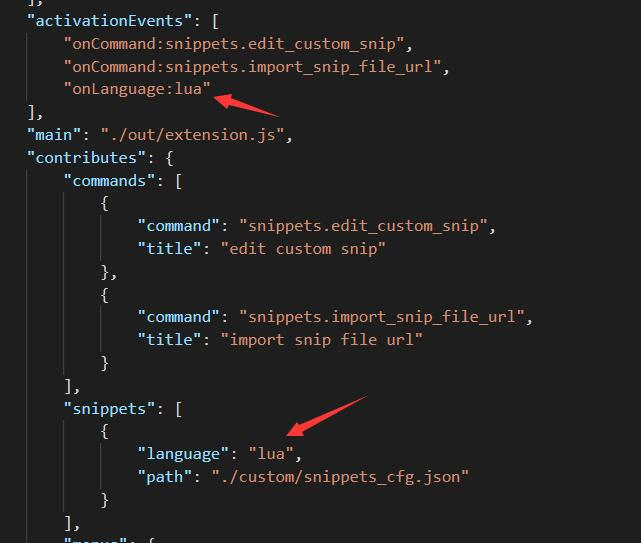
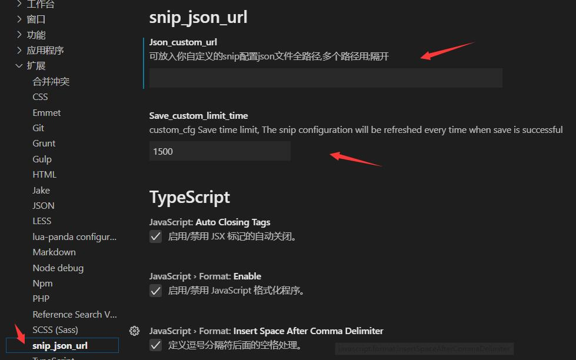

# snippets README

Based on the snippets of vscode, it supports the configuration of the code segment json file generated by your own code, Use it can improve a lot of efficiency

## Features

1.edit custom snip

    1).We can find it in the right-click menu after the plug-in is activated, or enter the search command ‘edit custom snip’ by ctrl+shift+p

    2).custom_cfg This file is used to store the code snippets defined by our own handwriting

> Tip: 
Please note that every time you save the file, it will trigger the merge json operation, so please don't do useless save behavior, although there are settings that define the save interval

    3).Then you can enter prefix in the specified type file to get the corresponding body part, Easily get what you save

2.import_snip_file_url

    We may need to use other scripts to generate a large number of code snippets A. If they are put together in custom_cfg, it will be difficult to update when A is changed, so it is made to support multiple code snippets.

    An input box will appear in vscode when you use the command import_snip_file_url

> Tip: 
It should be noted that after the above two methods are modified, you need to restart vscode to use

3.change language

    Now the default is to set the lua file to take effect. If you want to change the part of the plugin’s package.json to the language type you want

## Extension Settings

This extension contributes the following settings:

* `json_custom_url`: 
It is the setting of import_snip_file_url operation
* `Save_custom_limit_time`: custom_cfg file save limit interval

## FAQ
1 
If you have a problem that json limited to 5000 items,
reference link https://github.com/microsoft/vscode/issues/84259

**Enjoy!**
